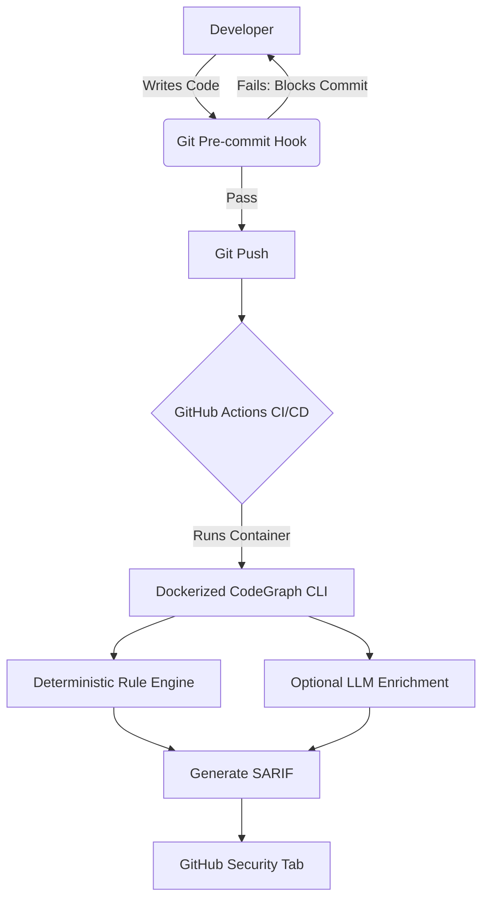

# 🧠 CodeGraph AI


**CodeGraph AI** is an enterprise-grade repository intelligence engine that analyzes code changes, detects bugs and security vulnerabilities, computes change impact, and auto-generates tests — using a **hybrid architecture** that combines a deterministic rule engine with optional LLM enrichment.

---

## 📑 Table of Contents

- [Why CodeGraph AI?](#-why-codegraph-ai)
- [Design Philosophy](#-design-philosophy)
- [Key Features](#-key-features)
- [Architecture Deep Dive](#-architecture-deep-dive)
- [Security Model](#-security-model)
- [Project Structure](#-project-structure)
- [Installation](#-installation)
- [Quick Start](#-quick-start)
- [CLI Reference](#-cli-reference)
- [Web Dashboard](#-web-dashboard)
- [Benchmark Results](#-benchmark-results)
- [Enterprise Integration](#-enterprise-integration)
- [Testing](#-testing)
- [Roadmap](#-roadmap)
- [Contributing](#-contributing)
- [License](#-license)

---

## 🎯 Why CodeGraph AI?

Most AI code reviewers rely purely on LLMs. That is dangerous for CI/CD pipelines: LLMs **hallucinate**, they are **slow**, they **cost money per token**, and if the API is rate-limited, the entire pipeline breaks.

CodeGraph AI solves this with a **Hybrid Review Architecture**:

1. **Deterministic Core (always on):** Static analysis via `pylint`, `bandit`, and `flake8`, normalized into a unified schema and scored by confidence. Fast, free, and 100% reproducible.
2. **Optional LLM Enrichment (`--llm`):** When an API key is configured, findings are augmented with natural-language explanations via a provider-agnostic API. If the call fails, the system **gracefully degrades** to the deterministic core. The pipeline never breaks.

---

## 🧭 Design Philosophy

CodeGraph AI is built on four engineering principles that guide every architectural decision.

### 1. Determinism First
A code-review tool that runs inside a CI pipeline must be **reproducible**. The same input must always produce the same output. That is why the core engine is rule-based: it parses the AST and runs static analyzers, guaranteeing zero-latency, zero-cost, and zero-hallucination results. AI is treated as an *enhancement layer*, never as a dependency.

### 2. Graceful Degradation
External services fail. APIs get rate-limited, keys expire, and networks drop. CodeGraph AI is designed so that **no single failure can break the pipeline**. If the LLM layer is unavailable, the system silently falls back to the deterministic core. If a static analyzer is missing, the others still run. The tool always produces a result.

### 3. Security by Default
The tool itself must never become an attack vector. Generated code is executed in a **sandboxed subprocess** with a strict timeout, so an infinite loop or malicious payload can never compromise the host machine. This is critical for any system that executes AI-generated code.

### 4. Measurable Quality
"Works on my machine" is not an engineering standard. CodeGraph AI ships with an **evaluation framework** that computes Precision, Recall, and F1 against a labeled benchmark. Quality is a number you can track, not a feeling.

---

## ✨ Key Features

| Feature | Description |
|---|---|
| 🔍 **Unified Static Analysis** | Integrates pylint, bandit, and flake8 into one normalized issue schema |
| 🗺️ **AST Code Maps** | Extracts functions, classes, methods, and imports via the Python AST |
| 💥 **Impact Analysis** | Builds call graphs to compute the exact "blast radius" of a change |
| 📝 **Hybrid Code Review** | Deterministic review with confidence scoring + optional LLM enrichment |
| 🧪 **Auto Test Generation** | Generates pytest files and executes them in a sandboxed subprocess |
| 🤖 **GitHub PR Reviewer** | Analyzes live pull requests via the GitHub REST API |
| 🛡️ **SARIF Output** | Native integration with GitHub Advanced Security |
| 🐳 **Dockerized** | Zero-dependency execution in any CI pipeline |
| 🛑 **Pre-commit Hook** | Shift-left security that blocks vulnerable commits |
| 📊 **Benchmarking** | Precision / Recall / F1 evaluation against a labeled dataset |
| 🖥️ **Web Dashboard** | Interactive Streamlit UI with visual analysis modes |

---

## 🏗️ Architecture Deep Dive

### DevSecOps Pipeline Flow



### 1. Unified Static Analysis Pipeline
Each analyzer (pylint, bandit, flake8) is executed as an isolated subprocess and emits raw JSON or text. The `normalizer` then maps every tool's heterogeneous output into a **single unified schema** (`tool`, `severity`, `line`, `message`, `confidence`). This decouples the analyzers from the consumers: the reviewer, the dashboard, and the SARIF emitter all read one consistent format, so adding a new analyzer requires only a new mapping function.

### 2. AST Code Mapping
Rather than regex-based parsing, CodeGraph AI uses Python's native `ast` module to build a structural map of the file. It extracts every function, class, method, and import along with line numbers and argument signatures. This structural understanding is the foundation for both the call graph and the test generator, ensuring the tool reasons about *code*, not text.

### 3. Call Graph & Impact Analysis ("Blast Radius")
Finding a bug is only half the job. If a developer changes `divide()`, what else breaks? CodeGraph AI walks the AST to build a **caller→callee graph**, then performs a reverse traversal from the changed functions to compute the full set of impacted callers. This "blast radius" tells a reviewer exactly which parts of the system are at risk from a single edit.

### 4. Hybrid Review Engine & Confidence Scoring
The reviewer consumes the unified issue schema and assigns a **confidence score** to each finding. High-confidence issues (e.g., a bandit security flag) are surfaced as blocking; low-confidence style notes are downgraded. When `--llm` is enabled, findings are sent to a provider-agnostic chat-completions endpoint for natural-language enrichment, but the deterministic verdict always stands as the source of truth.

### 5. GitHub PR Reviewer
Given a pull-request URL, the tool parses `owner/repo/number`, fetches PR metadata and the changed-file list from the GitHub REST API, downloads each changed `.py` file at the head SHA, and runs the full analysis pipeline against it. Results are aggregated into a per-file report, enabling review of *live* pull requests without cloning the repository.

### Module Breakdown

| Module | Responsibility |
|---|---|
| `analyzer.py` | Executes pylint / bandit / flake8 as subprocesses |
| `normalizer.py` | Converts raw tool output into a unified issue schema |
| `ast_parser.py` | Parses the AST into a code map (functions, classes, imports) |
| `graph.py` | Builds the call graph and computes change impact |
| `diff_parser.py` | Understands git diffs for PR-level analysis |
| `reviewer.py` | Hybrid review engine (rules + optional LLM with fallback) |
| `test_generator.py` | Generates pytest code (LLM or rule-based) |
| `sandbox.py` | Executes generated tests safely with a timeout |
| `evaluation.py` | Computes precision, recall, and F1 against benchmarks |
| `pr_reviewer.py` | Fetches and reviews live GitHub pull requests |
| `sarif.py` | Emits SARIF v2.1.0 for GitHub Advanced Security |
| `printer.py` | Rich terminal UI (tables, panels, syntax highlighting) |
| `main.py` | CLI entry point |

---

## 🛡️ Security Model

CodeGraph AI executes AI-generated code, so it must be safe by construction. The sandbox enforces three guarantees:

1. **Isolation:** Generated tests are written to a temporary directory and executed via `subprocess`, never imported into the running process. This prevents generated code from touching the tool's own memory or state.
2. **Timeout:** Every execution is bounded by a strict 30-second limit. If a test hangs (e.g., an infinite loop), the OS kills the child process and the tool returns a clean failure state.
3. **Containment:** The subprocess runs with no network privileges and no access to the tool's credentials, so a malicious payload cannot exfiltrate data or escalate.

---

## 📁 Project Structure

```text
codegraph-ai/
├── codegraph/
│   ├── __init__.py
│   ├── main.py             # CLI entry point
│   ├── analyzer.py         # pylint / bandit / flake8 runner
│   ├── normalizer.py       # unified issue schema
│   ├── ast_parser.py       # code map
│   ├── graph.py            # call graph + impact analysis
│   ├── diff_parser.py      # git diff understanding
│   ├── reviewer.py         # hybrid review engine
│   ├── test_generator.py   # pytest generation
│   ├── sandbox.py          # safe test execution
│   ├── evaluation.py       # precision / recall / F1
│   ├── pr_reviewer.py      # GitHub PR analysis
│   ├── sarif.py            # SARIF v2.1.0 output
│   └── printer.py          # rich terminal UI
├── tests/                  # 40 automated tests
├── samples/                # sample vulnerable files
├── data/                   # benchmark dataset
├── app.py                  # Streamlit web dashboard
├── Dockerfile              # containerized execution
├── .pre-commit-hooks.yaml  # shift-left security hook
├── pyproject.toml          # PyPI packaging metadata
└── .github/workflows/      # CI pipeline
```

---

## 📦 Installation

### From Source

```bash
git clone https://github.com/iniya304/codegraph-ai.git
cd codegraph-ai
python -m venv venv
source venv/bin/activate   # Windows: venv\Scripts\activate
pip install -r requirements.txt
```

### From PyPI (Test Registry)

```bash
pip install -i https://test.pypi.org/simple/ codegraph-ai
```

### With Docker

```bash
docker build -t codegraph-ai .
```

---

## ⚡ Quick Start

```bash
# Analyze a file
python -m codegraph.main samples/buggy_code.py

# Review with confidence scoring
python -m codegraph.main --review samples/buggy_code.py

# See the blast radius of a change
python -m codegraph.main --impact samples/buggy_code.py --changed divide

# Review a live GitHub pull request
python -m codegraph.main --pr https://github.com/iniya304/codegraph-ai/pull/1
```

---

## 🖥️ CLI Reference

| Command | Description |
|---|---|
| `python -m codegraph.main <file.py>` | Analyze a file and print unified issues |
| `--unified` | Print the normalized issue schema |
| `--diff [ref]` | Summarize a git diff |
| `--map <file.py>` | Print the AST code map |
| `--impact <file.py> --changed fn1,fn2` | Compute change impact (blast radius) |
| `--review <file.py> [--llm]` | Run the hybrid code review |
| `--generate-tests <file.py> [--run] [--out path]` | Generate (and optionally run) pytest files |
| `--evaluate [benchmark.json]` | Run precision / recall / F1 benchmark |
| `--pr <github-pr-url>` | Review a live GitHub pull request |
| `--sarif` | Emit a SARIF v2.1.0 report (`results.sarif`) |

---

## 🌐 Web Dashboard

CodeGraph AI ships with an interactive **Streamlit** dashboard featuring six analysis modes: Analyze, Code Map, Impact Analysis, Code Review, Test Generation, and Benchmarking.

```bash
streamlit run app.py
```

---

## 📊 Benchmark Results

The deterministic engine is evaluated against a labeled security benchmark dataset using standard ML metrics:

| Metric | Score |
|---|---|
| **Precision** | 100% |
| **Recall** | 100% |
| **F1 Score** | **1.0** |

Run the evaluation yourself:

```bash
python -m codegraph.main --evaluate
```

---

## 🏢 Enterprise Integration

### 1. Shift-Left Security (Pre-commit)

Block vulnerable code before it enters the repository history. Add to your `.pre-commit-config.yaml`:

```yaml
repos:
  - repo: https://github.com/iniya304/codegraph-ai
    rev: v1.3.0
    hooks:
      - id: codegraph-ai
```

### 2. GitHub Advanced Security (SARIF)

Surface findings natively in the repository **Security** tab:

```yaml
- name: Run CodeGraph AI
  run: python -m codegraph.main target.py --sarif

- name: Upload SARIF
  uses: github/codeql-action/upload-sarif@v3
  with:
    sarif_file: results.sarif
```

### 3. Containerized CI Execution

Run the analyzer in any pipeline without installing Python dependencies:

```bash
docker run --rm codegraph-ai samples/buggy_code.py

# Analyze your own code by mounting a volume
docker run --rm -v ${PWD}:/work codegraph-ai /work/your_file.py
```

### 4. Optional LLM Enrichment

To enable the AI layer, create a `.env` file:

```text
OPENAI_API_KEY=your_key
CODEGRAPH_LLM_BASE_URL=https://api.groq.com/openai/v1
CODEGRAPH_LLM_MODEL=llama-3.3-70b-versatile
```

Without a key, the system automatically uses the deterministic core.

---

## 🧪 Testing

The project ships with **40 automated tests** covering every module:

```bash
python -m pytest
```

---

## 🗺️ Roadmap

- [ ] VS Code extension for inline findings
- [ ] Multi-language support (JavaScript, Go)
- [ ] Incremental analysis cache for monorepos
- [ ] Slack / Teams notifications for high-severity findings

---

## 🤝 Contributing

Contributions are welcome! Open an issue to discuss major changes, and follow the existing style: docstrings on all public functions, tests for new features, and atomic commits.

---

## 📄 License

MIT License. See `pyproject.toml` for details.

---

## 👤 Author

Built by **[Iniya M](https://github.com/iniya304)**